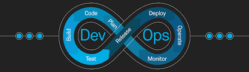

<!-- markdownlint-disable MD013 MD033 MD034 -->
# NPM GROOVY LINT (+ Format & Auto-fix)

[](https://npmjs.org/package/npm-groovy-lint)
[](https://npmjs.org/package/npm-groovy-lint)
[](https://npmjs.org/package/npm-groovy-lint)
[](https://github.com/nvuillam/npm-groovy-lint/actions?query=workflow%3ATest+branch%3Amaster)
[](https://codecov.io/gh/nvuillam/npm-groovy-lint)
[](https://github.com/nvuillam/npm-groovy-lint/actions/workflows/mega-linter.yml)
[](https://gitHub.com/nvuillam/npm-groovy-lint/graphs/contributors/)
[](https://GitHub.com/nvuillam/npm-groovy-lint/stargazers/)
[](https://hub.docker.com/r/nvuillam/npm-groovy-lint)
[](https://hub.docker.com/r/nvuillam/npm-groovy-lint)
[](https://github.com/nvuillam/npm-groovy-lint/blob/master/package.json)
[](http://makeapullrequest.com)

<p align="center">
  
</p>

# jenkins-devops-microservices

- [Jenkins: How do I lint Jenkins pipelines from the command line?](https://stackoverflow.com/questions/44703012/jenkins-how-do-i-lint-jenkins-pipelines-from-the-command-line)

```bash
curl --user atoosa:Codered2015 -X POST -F "jenkinsfile=<Jenkinsfile" http://localhost:8081/pipeline-model-converter/validate
```

```bash
docker network create jenkins
```
